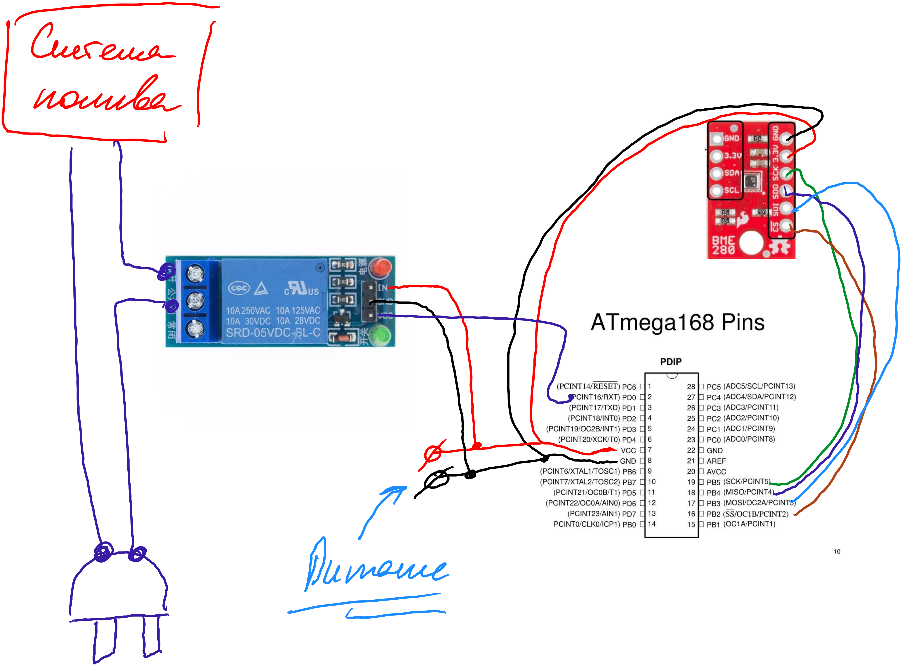

# Задание на автомат «Влажный день»  

Микроконтроллер оценивает с помощью датчиков влажности относительную влажность помещения, и в зависимости от параметров настройки открывает или закрывает рыле для другой силовой нагрузки.

**Задача с проблемой симуляции работы SPI интерфейса**
[Демонстрационное видео работы SPI c датчиком BME280](https://www.youtube.com/watch?v=MCi7dCBhVpQ)

